<p align="center">
  
</p>

# Agricultural Yield Simulator Interview Questions 🌾📊

<p align="center">
  <a href="https://github.com/ishandutta2007/Awesome-Awesome-Awesome"></a><a href="https://discord.gg/jc4xtF58Ve"></a> <a href="https://github.com/ishandutta2007/Awesome-Agricultural-Yield-Simulator-Interview-Questions/blob/main/LICENSE"></a><a href="https://github.com/ishandutta2007/Awesome-Agricultural-Yield-Simulator-Interview-Questions/pulls"></a>
</p>

## 🎯 High-Performance Crop Yield Modeling & Simulation Resources

Welcome to the ultimate curated, community-driven collection of interview questions, model answers, frameworks, and explanations for roles building **crop yield simulation, predictive modeling, and agronomic decision-support systems**. 

This repository connects **mechanistic crop growth modeling** (like DSSAT, APSIM, and WOFOST), **remote sensing & earth observation** (MODIS, Landsat, Sentinel, NDVI, LAI), **climate/weather data integration**, and **machine learning/deep learning** to predict, simulate, and explain agricultural yield. 🌾🚀


> 📝 **A note on the title:** "Agricultural Yield Simulator" describes the system, not a standardized job title — titles you're more likely to actually see include "Crop Modeling Scientist," "Agricultural Data Scientist," or "Precision Agriculture Engineer" at an agtech company, seed/crop-protection company, or agricultural research institution. Crop simulation modeling itself is a mature, decades-old discipline (process-based crop models predate modern ML by decades), and this repo treats it accordingly.

This is not a list of trivia. Every question includes:
- 💡 **Why interviewers ask it**
- 🎯 **A model answer or framework**
- 🔍 **Follow-up questions** interviewers commonly use to probe deeper

> 🌱 This is v1. Contributions, corrections, and new questions are very welcome — see [CONTRIBUTING.md](CONTRIBUTING.md).

> ⚠️ **Note on scope:** This role sits at the intersection of agronomy/plant science, earth observation, and machine learning. This repo assumes some existing background in one of these areas and focuses on the translation work connecting them. A recurring theme throughout is honesty about generalization limits — a yield model validated in one region, crop, or season is not automatically valid elsewhere, and answers throughout reflect that discipline rather than overstating a model's transferability.

---

## 📚 Table of Contents

| # | Category | What it covers |
|---|----------|-----------------|
| 1 | [🌱 Agricultural Systems & Crop Modeling Fundamentals](questions/01-agricultural-systems-and-crop-modeling-fundamentals.md) | Mechanistic vs. statistical models, the genotype-environment-management framework |
| 2 | [🌾 Crop Growth & Physiological Modeling](questions/02-crop-growth-and-physiological-modeling.md) | Phenology, biomass accumulation, water/nutrient stress modeling |
| 3 | [🛰️ Remote Sensing & Earth Observation](questions/03-remote-sensing-and-earth-observation.md) | Satellite imagery, vegetation indices, ML for yield prediction from space |
| 4 | [☁️ Weather, Climate Data & Uncertainty](questions/04-weather-climate-data-and-uncertainty.md) | Weather data integration, climate projections, propagating uncertainty |
| 5 | [🤖 Machine Learning & Hybrid Modeling](questions/05-machine-learning-and-hybrid-modeling.md) | ML vs. mechanistic models, hybrid approaches, transfer across regions |
| 6 | [📊 Data Challenges in Agricultural Modeling](questions/06-data-challenges-in-agricultural-modeling.md) | Heterogeneous farm data, sparse ground truth, scale mismatch |
| 7 | [⚖️ Validation, Calibration & Decision Support](questions/07-validation-calibration-and-decision-support.md) | Validating against real yields, communicating uncertainty to growers |
| 8 | [💼 Behavioral & Case Studies](questions/08-behavioral-and-case-studies.md) | Cross-disciplinary collaboration, real-world modeling tradeoffs |

Also see: [resources.md](resources.md) for external reading, key models, and communities.


---

## 🧭 How to Use This Repo

- **Coming from an agronomy/plant science background?** Prioritize sections 5 and 6 — the goal is building fluency in how ML models are actually built, validated, and deployed, and the specific data challenges that come with it.
- **Coming from a data science/ML background?** Prioritize sections 1 and 2 — you'll need working fluency in crop physiology and the mechanistic modeling tradition before your ML skills are usefully applied to this domain, since this field has decades of process-based modeling precedent that a purely data-driven approach often reinvents poorly.
- **Interviewing at a company focused on remote-sensing-based yield prediction?** Focus heavily on section 3.
- **Interviewing at a company building decision-support tools for growers?** Focus heavily on section 7.
- **Interviewing at a seed or crop breeding company?** Focus heavily on sections 1 and 2 — genotype-by-environment interaction is often central to that context.

Each question is tagged with a rough difficulty and role-level indicator:
- 🟢 Junior/Entry-level · 🟡 Mid-level Scientist/Engineer · 🔴 Senior/Principal

---

## 🗂 Repo Structure

```
agricultural-yield-simulator-interview-questions/
├── README.md                                              ← you are here
├── CONTRIBUTING.md
├── LICENSE
├── resources.md
└── questions/
    ├── 01-agricultural-systems-and-crop-modeling-fundamentals.md
    ├── 02-crop-growth-and-physiological-modeling.md
    ├── 03-remote-sensing-and-earth-observation.md
    ├── 04-weather-climate-data-and-uncertainty.md
    ├── 05-machine-learning-and-hybrid-modeling.md
    ├── 06-data-challenges-in-agricultural-modeling.md
    ├── 07-validation-calibration-and-decision-support.md
    └── 08-behavioral-and-case-studies.md
```

## 🤝 Contributing

PRs are the whole point of this repo. If you were asked a question in a real interview that isn't here, add it! See [CONTRIBUTING.md](CONTRIBUTING.md) for format guidelines.

## 📄 License

Content is available under [MIT License](LICENSE) — use it freely for your own prep, mock interviews, or hiring loops.

## ⭐ Support

If this helped you land an offer, consider starring the repo and adding the question that stumped you — it might help the next person.
